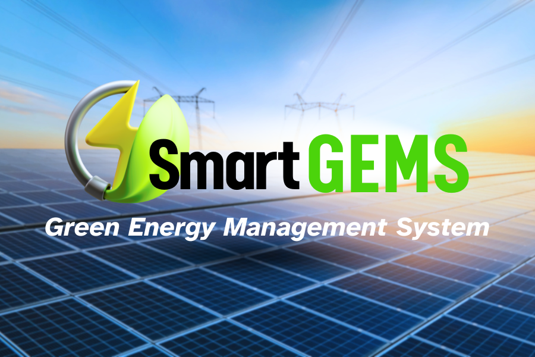

# SmartGEMS
### Green energy = unstable and superficial?! 
### Fear no more of solar power outages on cloudy days with SmartGEMS, a smart power grid that optimizes energy production from real-time environment conditions!

Energy is a big factor of the environment. As we move from environmentally damaging energy sources such as oil and natural gas to green energy sources including wind, water, solar, and geothermal we face the major challenge of inconsistency due to weather. Lack of sunlight and wind, or water-freezing temperature would cause blackouts and power shortages that conventional power grids can not resolve. Our project, the Smart Green Energy Management System (SmartGEMS), optimizes the energy source and distribution based on real time environment conditions and power demand which ensures maximum stability while using renewable energy sources. 

